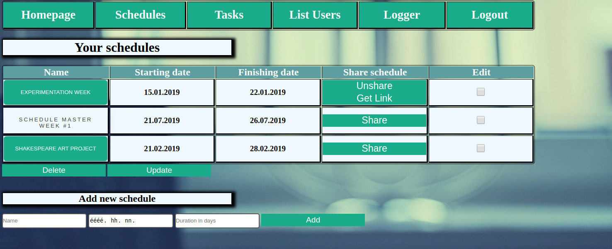

# Schedule Master 2000
> A schedule planner where users can create multiple schedules in which they can create tasks and share them by a link! Admins can view user list and activity!



## Details
The project was made with Java and PostgreSQL back end and javascript front end. It's a single page web application where  Javascript was used for DOM manipulation and asynchronous method execution.
The webapp uses Java servlets for RESTful services, and PostgreSQL for database handling.

It was made under four weeks in a team with SCRUM.

#### Requirements for running the webapp
- Java 8.0 or higher
- PostgreSQL
- Apache Tomcat
- Maven

#### Deploying the webapp for Apache Tomcat

OS X & Linux:
```sh
mvn clean package tomcat7:redeploy
```

#### Running the webapp
After deploying the webapp application will run in the browser under http://localhost:8080/schedule-master-2000/ url.

## Meta
- szucsaron
- zuborati1987
- imgergopapp
